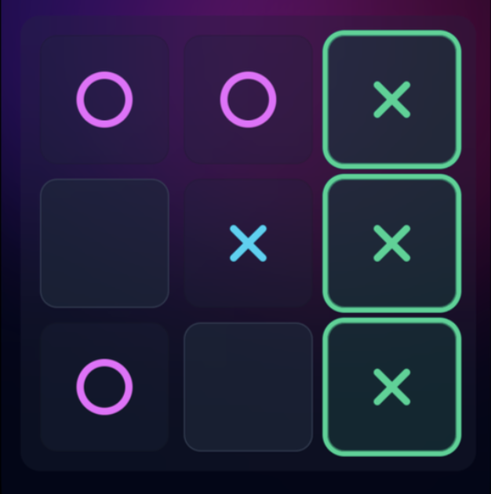
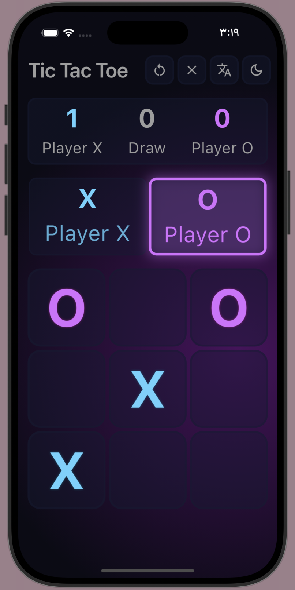
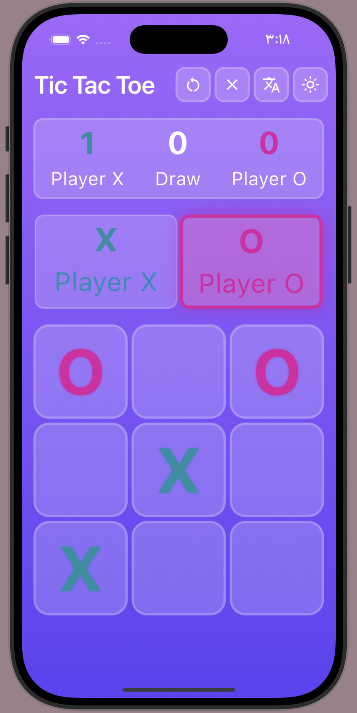
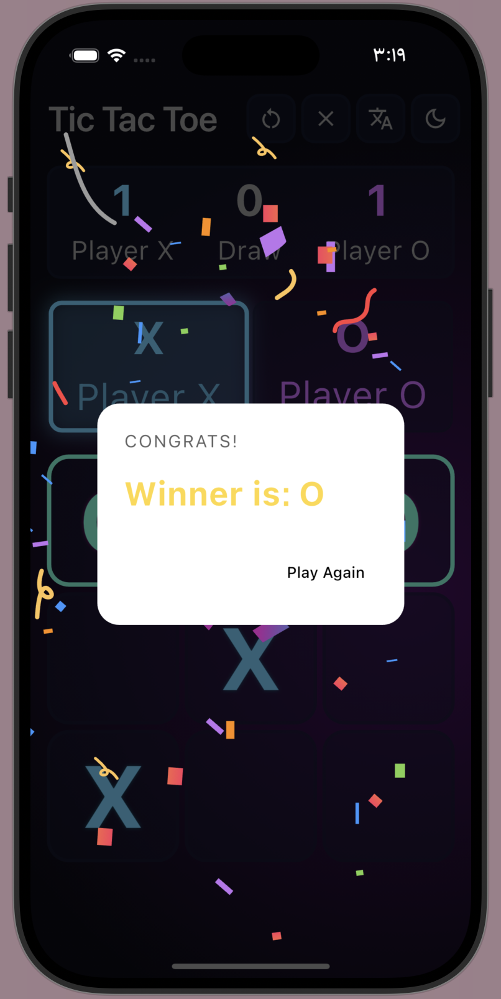
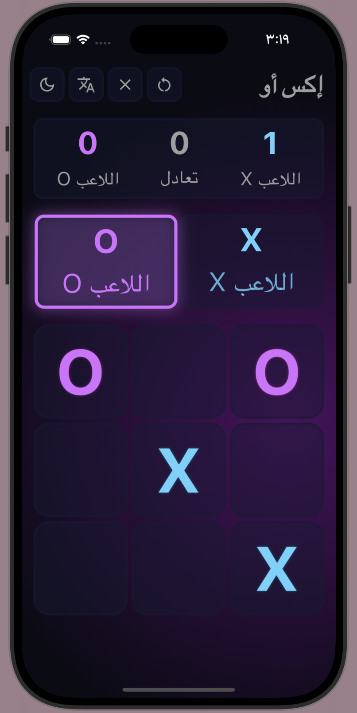
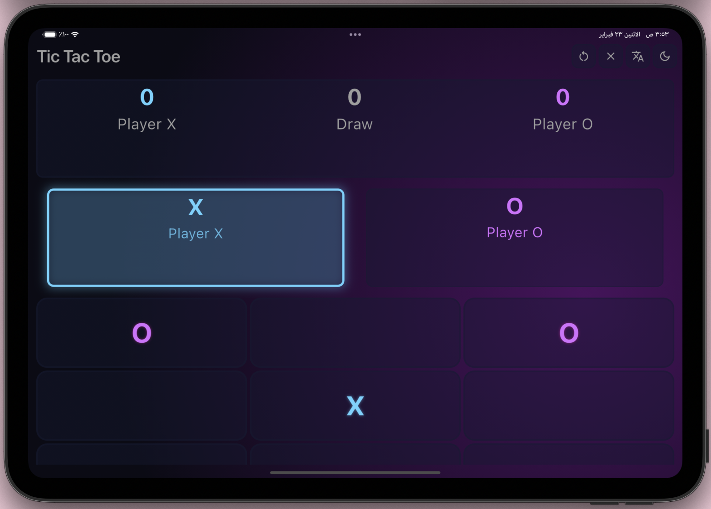

# 🎮 Tic Tac Toe – Advanced Flutter Edition


A modern and interactive **Tic Tac Toe game built with Flutter**, showcasing advanced UI/UX, smooth animations, responsive design, localization (RTL/LTR), and clean project structure.

This project demonstrates practical Flutter development concepts including animations, theming, localization, and reusable UI components.

---
## 🎥 Demo Video

[](https://drive.google.com/file/d/1X7AimsG2YJ7xUpQZ8wfFwr6Cla_h8HGi/view?usp=drivesdk)

---

## 📸 Screenshots

### 🌙 Dark Mode


### ☀️ Light Mode


### 🏆 Win Celebration


### 🌍 Arabic (RTL) Mode


### 📱 iPad (Responsive Layout)


---

## ✨ Features

### 🧠 Smart Game Logic
- Win detection (horizontal, vertical, diagonal)
- Draw detection
- Score tracking (Player X, Player O, Draw)
- Turn switching
- Undo last move

---

## 🎨 Dynamic Theming

- Light Mode
- Dark Mode
- Custom gradients
- Glows & shadows
- Theme switching using ThemeData

---

## 🎞 Animations & Effects

- Implicit animations using `AnimatedContainer`
- Explicit board flip animation
- Win celebration animation powered by [flutter_animate](https://pub.dev/packages/flutter_animate)
- Lottie celebration animation using [lottie](https://pub.dev/packages/lottie)
- Victory sound effect using [audioplayers](https://pub.dev/packages/audioplayers)

---

## 🌍 Localization (RTL / LTR Support)

- English (LTR)
- Arabic (RTL)
- Automatic layout mirroring

---

## 📱 Responsive Layout

- Small mobile screens
- Large mobile screens
- Adaptive UI using LayoutBuilder & flexible widgets

---

## 🛠 Tech Stack

- **Flutter** – Cross-platform UI framework  
- **Dart** – Programming language  
- **State Management** – setState  
- **Theming System** – Custom ThemeData (Light & Dark Mode)  
- **Animations** – Implicit & Explicit animations  
- **Third-Party Packages** – flutter_animate, lottie, audioplayers

---

## 📦 Packages Used

- flutter_animate
- lottie
- audioplayers

---

# 🏗 Project Structure

```text

lib
│
├── controllers
│
├── models
│
├── views
│   ├── screens
│   └── widgets
│
├── theme
│
├── l10n
│
└── main.dart
```

---

## 🚀 Getting Started
1. Clone the repository
2. Run:
```
flutter pub get
flutter run
```

---

## 👨‍💻 Author

**Ghaida Khalid Albarqi**  

- GitHub: https://github.com/ghaydaLabs
- LinkedIn: https://linkedin.com/in/ghayda-khalid
- Email: ghayda.dev@outlook.sa
